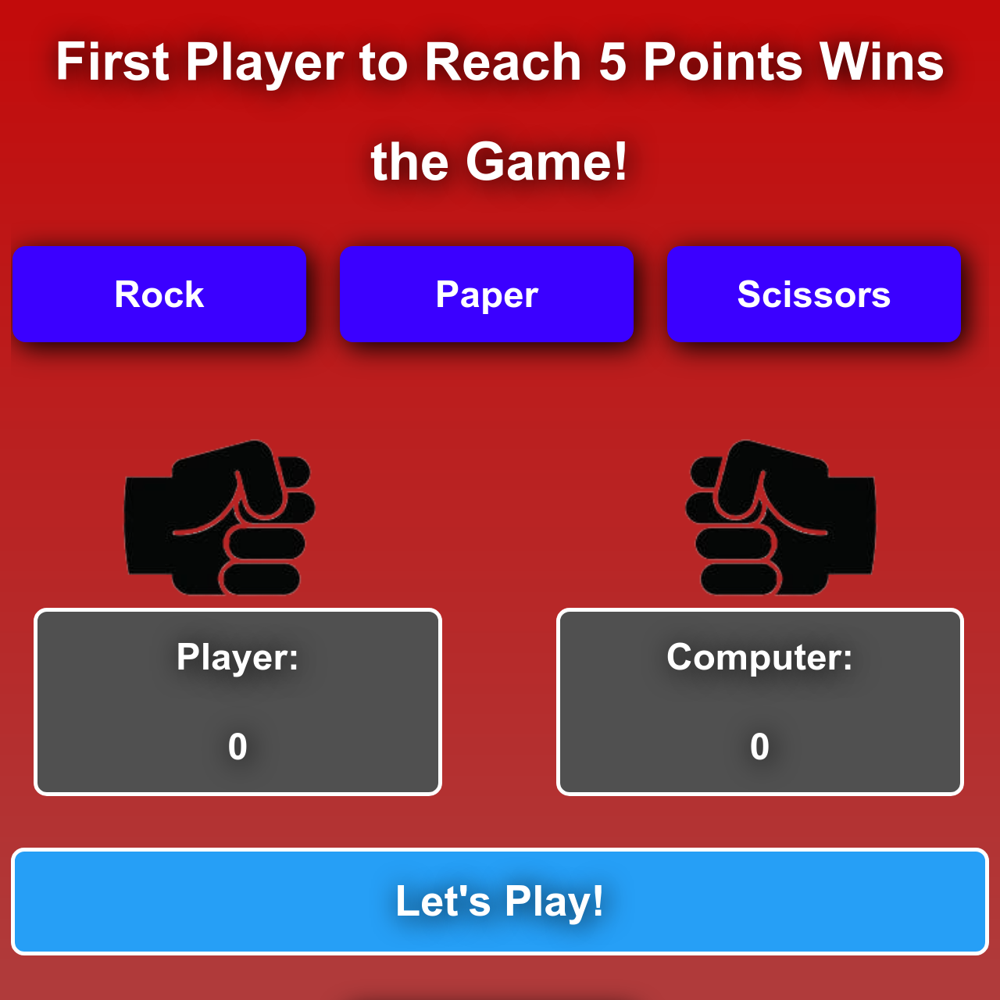

# JavaScript Rock Paper Scissors Game

> JavaScript Game Written for The Odin Project

<div align='center'>
  
</div><br>

## Demo

[View the Live Demo](https://andrewbaldwin44.github.io/Rock_Paper_Scissors/)

## How to Play?

1. Rock beats paper
2. Paper beats rock
3. Rock beats scissors
4. And scissors beats paper
5. Anything else results in a tie! First to 5 wins!

## Features

1. A fully responsive design. Enjoy the app on any device!
2. Game animation to visually see the game results!

## Deploy the project

__Clone the repo to your local machine using the terminal__:
```
$ git clone git@github.com:andrewbaldwin44/Rock_Paper_Scissors.git
```

*Then Open the `index.html` Project File in Your Browser*

## Technologies Used:

- JavaScript
- HTML
- CSS

## Author

👤 **Andrew Baldwin**

- Github: [@andrewbaldwin44](https://github.com/andrewbaldwin44)
